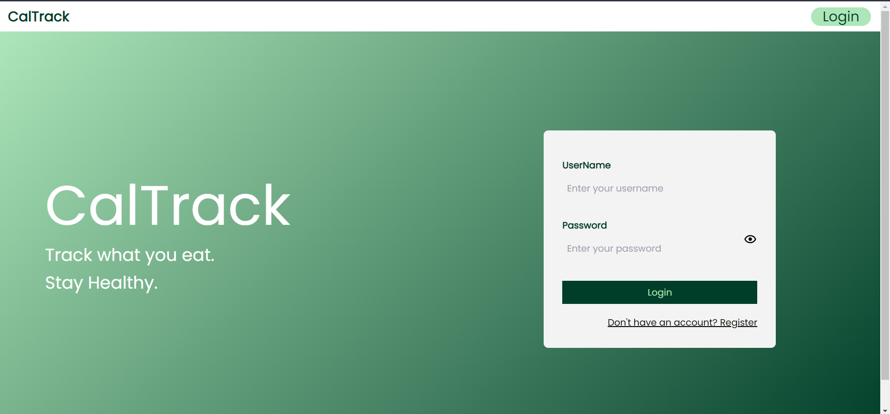
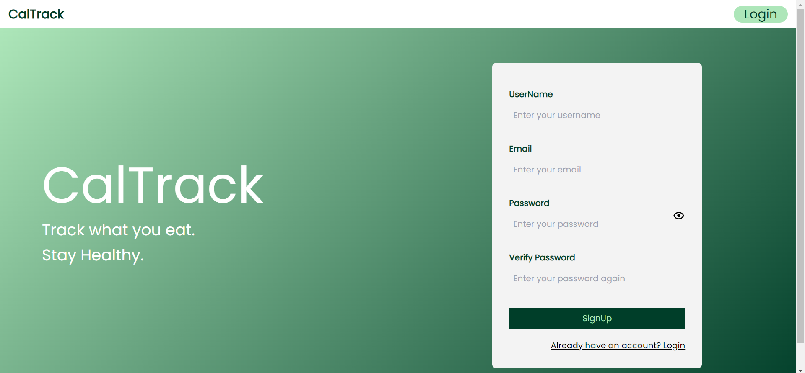
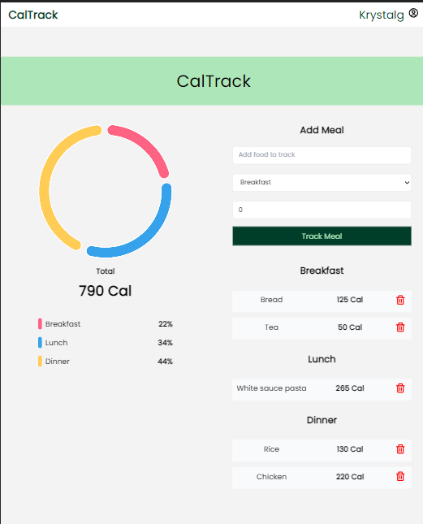

# CalTrack :-

**CalTrack** is a simple MERN stack web application, that helps users track their calories and stick to their diets better. Users can create accounts to save their progress, and get insights on their diets.

# Images :-

- ### **Login/Register Page**

  

  

- ### **Tracker Page**
  
